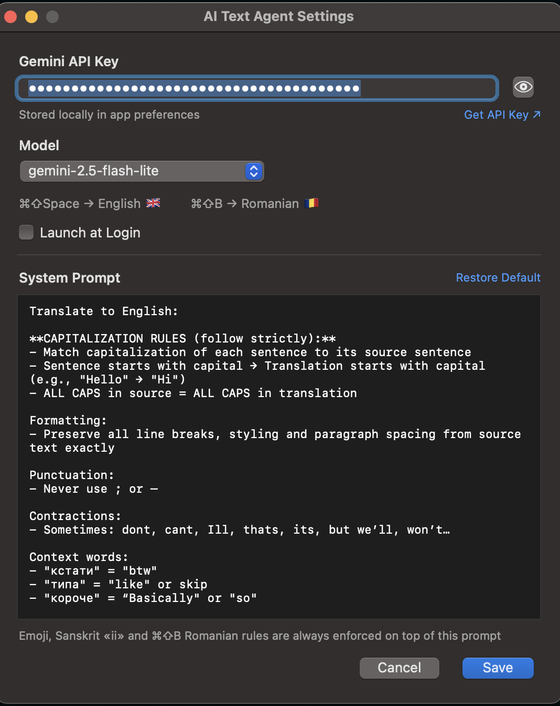

<div align="center">

# 🧠 AI Text Agent

**Instant clipboard translation for macOS. Copy → hotkey → paste.**

Menu bar app that translates whatever is in your clipboard to English or Romanian
using Google Gemini. No windows, no clicks, no context switching.

[](https://github.com/timurco/AiTextAgent)
[](Package.swift)
[](LICENSE)
[](https://github.com/timurco/AiTextAgent/releases/latest)


</div>

## How It Works

1. Copy any text — any language, any app (`⌘C`)
2. Press the hotkey
3. Paste the translation (`⌘V`)

| Hotkey | Target language |
|--------|-----------------|
| `⌘⇧Space` | English 🇬🇧 |
| `⌘⇧B` | Romanian 🇷🇴 |

The translation replaces your clipboard. The original text is kept in the
menu bar history — one click brings it back.

## Features

- **Two hotkeys, two languages** — English and Romanian, adding more is a few lines of code
- **Emoji preserved** — every emoji survives translation, in its original position
- **Original text history** — the menu keeps the last 4 pre-translation texts; click one to restore it to the clipboard
- **Tiny toast notifications** — a 150×40 toast under the menu bar icon: green header on success, red on error, with the target language flag; never steals focus
- **Live status in the menu bar** — 🧠 ready · ⏳ processing · ✅ done · ❌ error (hover for details)
- **Sanskrit-aware** — transliterates tradition-specific terms with long "ī" as "ii" (Vijayantii, Viirendra, Miira)
- **Customizable prompt** — edit the translation rules in Settings; hard rules (emoji, Sanskrit, language override) are enforced in code on top of it
- **Launch at Login** — native SMAppService, one checkbox
- **Zero dependencies** — pure Swift + AppKit, no Accessibility permissions needed

## Installation

### Quick install

```bash
curl -fsSL https://raw.githubusercontent.com/timurco/AiTextAgent/main/install.sh | bash
```

Downloads the latest release (or builds from source), installs to `/Applications/`
and helps you set up the API key.

### Manual

1. Download `AI-Text-Agent.zip` from the [latest release](https://github.com/timurco/AiTextAgent/releases/latest)
2. Unzip and move `AI Text Agent.app` to `/Applications/`
3. Launch it — a 🧠 icon appears in the menu bar

### First-time setup

1. Get a free Gemini API key at [Google AI Studio](https://aistudio.google.com/apikey)
2. Click the 🧠 icon → **Settings…**
3. Paste the key and hit **Save**

## Settings

<div align="center">

</div>

- **API key** stored locally in app preferences, with show/hide toggle and a direct "Get API Key" link
- **Model picker** — any current Gemini model (`gemini-flash-latest` by default; `gemini-2.5-flash-lite` is the fastest/cheapest)
- **System prompt editor** — tune tone, punctuation, terminology; *Restore Default* brings back the stock prompt
- **Hard rules stay on** — emoji preservation, Sanskrit "ii" transliteration and the ⌘⇧B Romanian override are enforced in code, so they work even with a fully custom prompt

## Why Clipboard-Based?

No Accessibility API, no input monitoring, no screen recording permissions.
The app only reads the clipboard when *you* press the hotkey, and talks only
to the Google Gemini API. Everything else stays on your Mac.

## Building from Source

```bash
git clone https://github.com/timurco/AiTextAgent.git
cd AiTextAgent

./build_app.sh                        # build the .app bundle
cp -r "AI Text Agent.app" /Applications/

# or just the executable
swift build -c release                # → .build/release/AITextAgent
```

Requirements: macOS 13.0+, Swift 5.9+ (Xcode not required — plain SwiftPM project).

### Project layout

```
Sources/AITextAgent/
├── main.swift               # Entry point, AppDelegate
├── MenuBarController.swift  # Central orchestrator: menu, status, history
├── HotKeyManager.swift      # Global hotkeys (Carbon)
├── AIService.swift          # Gemini API client + hard prompt rules
├── TextCaptureService.swift # Clipboard I/O
├── SettingsManager.swift    # UserDefaults persistence + launch at login
├── SettingsWindow.swift     # Settings UI
└── ToastWindow.swift        # Toast notifications under the menu bar icon
```

## Troubleshooting

| Symptom | Fix |
|---------|-----|
| ❌ "Empty clipboard" | Copy text first — images and files are not supported |
| ❌ "API key not configured" | Menu bar 🧠 → Settings… → paste your key → Save |
| Hotkey does nothing | Another app may own `⌘⇧Space` / `⌘⇧B`; restart the app and check Console.app |
| Launch at Login won't stick | The app must live in `/Applications/` |
| Error toast / ❌ icon | Hover the icon for the message; check your connection and key |

## License

[MIT](LICENSE) © Timur Ko
